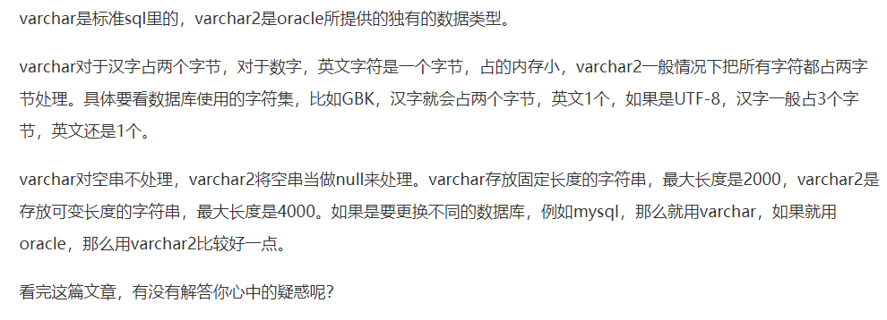

```java

	for (Product o:carts){	 
        if (o.getpId().equals("111")) {
            a += 1;
        } else if (o.getpId().equals("222")) {
            b += 1;
        }	    
	}
```
提示错误：（空指针错误）
Exception in thread "main" java.lang.NullPointerException
	at Test.main(Test.java:70)

正确如下：

```java

	for (Product o:carts){
	    if (o!=null) {
	        if (o.getpId().equals("111")) {
	            a += 1;
	        } else if (o.getpId().equals("222")) {
	            b += 1;
	        }
	    }
	}
```


#1.anni下载
#2.linux
#3.cmdshop
#4.github分支问题
#5.uml制图
#6.构造参数，super
#7.当一个类实现一个接口时，必须实现接口中的所有方法?


#1.查看字符串是否包含我们需要的

- contains
- indexof

#2.从字符串中拿一个字符

- charAt

#3.从字符串中拿一段字符

- substring 

#4.传递参数的两种方式

- 值传递
- 引用传递

#5.方法结束的标志

- return
- void 类型存在一个隐藏的return（可不输入）

#6.什么是成员变量，局部变量

- 成员变量（类内的变量，作用域从定义开始至类结束）
- 局部变量（在{}（语句块）之中的有效的变量，作用域从定义开始至语句块结束）

#7.什么是方法

- 方法就是用来完成解决某件事情或实现某个功能的代码集合

#8.什么是classpath

- class路径，用它来指定配置/资源文件的路径

#9.递归

- 在栈中运行？
- public class FactorialTest {
public static void main(String[] args) {
System.out.println(f(5));
}
private static int f(int n) {
if (n == 1) {
return 1;
} else {
return n *f((n - 1));
}
}
}代码是典型的bai一个递归方法算阶乘du。zhi
1、简单dao说递归就zhuan是在方法中调用自shu己；
2、比如例子说运行1653步骤：当n=5的时候，f()方法运算5*f(4)，又调用f(4)继续5*4*f(3)......最后等于5*4*3*2*1=120；

#10.maven是干嘛用的

- Maven 是一个项目管理和构建自动化工具
- 管理jar包

#11.java为什么不适用指针

- 它没有显式的使bai用指针，其实duJava语言zhi部的实现机制来说dao是肯定有指针的（zhuan有点废话了shu。。。）
用不用一样东西容是看有没有必要去用。Java是一个纯面向对象的语言，基本上来说，程序员不需要关心内存的分配与释放的操作（jre、虚拟机帮忙做了），既然不关心内存那么没必要引入指针这么种相对复杂而容易重大错误的一种形式。
其实Java里边充斥着引用的说法，从某种角度上说，引用就是指针的简化版。。。

#12.继承类之间的构造函数

- 1、父类未定义构造函数（系统提供一个默认的隐藏无参构造函数），子类可自由定义有参无参构造函数，子类创建对象时先去调用父类的无参构造函数
- 2、父类定义无参构造函数未定义有参构造函数（系统不在提供默认的隐藏无参构造函数），子类可自由定义有参无参构造函数，子类创建对象时先去调用父类的无参构造函数
- 3、父类定义无参构造函数和有参构造函数（系统不在提供默认的隐藏无参构造函数），子类可自由定义有参无参构造函数，子类创建对象时先去调用父类的无参构造函数
- 4、父类只定义了一个有参构造函数（系统不在提供默认的隐藏无参构造函数），子类定义的有参无参的构造函数中的第一行要显式调用父类构造函数，例如使用super
- 5、如果定义了一个有参数的构造函数，那么要在定义一个无参的构造函数，防止无默认提供的无参构造函数而出错
- this指向对象

#13.方法重写与方法重载的区别

- 重载： 发生在同一个类中，方法名必须相同，参数类型不同、个数不同、顺序不同，方法返回值和访问修饰符可以不同，发生在编译时。 　　

- 重写： 发生在父子类中，方法名、参数列表必须相同，返回值范围小于等于父类，抛出的异常范围小于等于父类，访问修饰符范围大于等于父类；如果父类方法访问修饰符为 private 则子类就不能重写该方法。

#14.final关键字

- 如果修饰变量，则一旦赋了值，就等同一个常量。
- final修饰的类肯定不能被继承
- final修饰的方法不能被重写
- final修饰的变量不允许被再次赋值

#15.static关键字

- 声明一个变量，则这个变量属于类，只占一份内存
- 在类中声明一个方法时没有static，则此方法属于对象，调用此方法时需要使用该类声明一个对象才能调用此方法
- 在类中声明一个方法时有static，则此方法属于类，调用此方法时直接用类名调用即可
- 类前加static则此类必须是另一个类的内部类

#16.接口与抽象的区别

- 1）接口不能有构造方法，抽象类可以有。
因为抽象类中可以有普通变量，构造方法用来初始化这些变量，而接口中只有静态常量，构造方法没有意义。
- 2）接口不能有方法体，抽象类可以有。
- 3）接口不能有静态方法，抽象类可以有。
- 4）在接口中凡是变量必须是public static final，而在抽象类中没有要求。

#17.java程序为何健壮？

- 有异常处理机制

#18.try catch finally

- try中可以有多行语句，自上而下运行，遇到错误的语句之后，然后跳到对应的catch，错误语句下面的语句不再运行。
- 多个catch，参数为子类的catch在前，参数为父类的catch在后。因为父类在前的话，所有的异常都可以用父类解决，用不到子类，则子类多余即出错。
- finally不管前面是否有异常都会执行一次

#19.常见的运行时异常

- NullPointerException：空指针
- ArithmeticException：数学运算异常
- ClassCastException：类转型异常
- NumberFormatException：数字格式异常
- ArrayIndexOutOfBoundsException：数组下标越界异常

#20.字节流

- office，pdf，图片，视频等使用记事本打开时乱码
- 字节流可读字符流
- exe文件中间不可以插入字节（损坏），末尾可以

#21.字符流

- txt，md等可用记事本打开的文本文件文件

#22.检查时异常（编译异常）

- IO
- sql
- Socket
- 用户自定义的异常？

#23.VARCHAR和VARCHAR2的区别



#24.数据类型转换

- 任意类型可直接转Object类型
- Object类型装其他类型需要强转
- 数值之间可用（数据类型）直接强转
- 字符串类型转数值，例Integer.parseInt(String)，Integer.valueOf(String)
- 数值转字符串，例String.valueOf(int)，Integer.toString(int)

#25.静态与构造方法

- new main()相当于调用了main这个类的构造方法
- 在A类之中声明一个变量a为静态的，在别的类中调用为A.a
- 在B类之中声明一个变量b为非静态的，在别的类中调用为B b1=new B();b1.b，b的值是属于对象的，在别的类new B()（产生一个新的对象）后所获得的b值不一致

#26.unicode

- gbk：汉字占两个字节，数字字母占一个字节
- utf-8（可变长字符编码）:汉字占三个字节，数字字母占一个字节

#27.

- ./指当前项目或工程所在的目录，非包

#28.==和equals

```
每一个new出来的对象给给对象变量赋值时 都是一个新地址吗？
我肯定回答你：是的，每次都是一个新地址。

在这里有点需要注意，对象是不是一样有两种比较方式，一种就是是不是同一个，一种就是是不是值相等。

是不是同一个，就是==号比较，例如：你有100块，我有100块，比较的两个对象是同一个物体 你用==比较就是false
== 比较的是内存中的地址是不是相同的，也就是你问的a与b的地址是不是相同，很显然不同，因为他们不是同一个。

另外一种就是是不是值相同，例如你的键盘ikbc104c这个型号的，你同事也有一个ikbc104c型号的，
这两个是相同的，比较的值是不是相同的。就像你有100块，我有100块，我们的钱是一样多的。
这个使用equalse比较的，如果不覆盖，就是调用Object的equalse方法，比较内存是不是同一个地址。
```

#29.文件流

- 字符流：JavaIO的类都是以Writer或Reader结尾   文本文件 .txt .md .java .c .cpp
- 字节流：Java类都是以Stream结尾   word、excel、ppt、图片(jpg,png,gif)、声音、视频.....  用记事本软件打开后，一堆乱码

#30.进程与线程的区别与联系

```
1.定义

进程是具有一定独立功能的程序关于某个数据集合上的一次运行活动,进程是系统进行资源分配和调度的一个独立单位.

线程是进程的一个实体,是CPU调度和分派的基本单位,它是比进程更小的能独立运行的基本单位.线程自己基本上不拥有系统资源,只拥有一点在运行中必不可少的资源(如程序计数器,一组寄存器和栈),但是它可与同属一个进程的其他的线程共享进程所拥有的全部资源.

2.关系
一个线程可以创建和撤销另一个线程;同一个进程中的多个线程之间可以并发执行.

相对进程而言，线程是一个更加接近于执行体的概念，它可以与同进程中的其他线程共享数据，但拥有自己的栈空间，拥有独立的执行序列。

3.区别
进程和线程的主要差别在于它们是不同的操作系统资源管理方式。进程有独立的地址空间，一个进程崩溃后，在保护模式下不会对其它进程产生影响，而线程只是一个进程中的不同执行路径。线程有自己的堆栈和局部变量，但线程之间没有单独的地址空间，一个线程死掉就等于整个进程死掉，所以多进程的程序要比多线程的程序健壮，但在进程切换时，耗费资源较大，效率要差一些。但对于一些要求同时进行并且又要共享某些变量的并发操作，只能用线程，不能用进程。

1) 简而言之,一个程序至少有一个进程,一个进程至少有一个线程.

2) 线程的划分尺度小于进程，使得多线程程序的并发性高。

3) 另外，进程在执行过程中拥有独立的内存单元，而多个线程共享内存，从而极大地提高了程序的运行效率。

4) 线程在执行过程中与进程还是有区别的。每个独立的线程有一个程序运行的入口、顺序执行序列和程序的出口。但是线程不能够独立执行，必须依存在应用程序中，由应用程序提供多个线程执行控制。

5) 从逻辑角度来看，多线程的意义在于一个应用程序中，有多个执行部分可以同时执行。但操作系统并没有将多个线程看做多个独立的应用，来实现进程的调度和管理以及资源分配。这就是进程和线程的重要区别。

4.优缺点
线程和进程在使用上各有优缺点：线程执行开销小，但不利于资源的管理和保护；而进程正相反。同时，线程适合于在SMP机器上运行，而进程则可以跨机器迁移。
```

