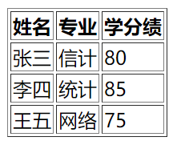
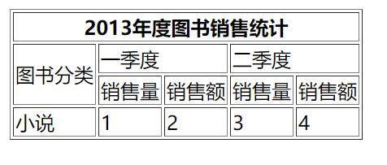

### HTML简介

```html
**HTML**（超文本标记语言——HyperText Markup Language）是构成 Web 世界的一砖一瓦。它定义了网页内容的含义和结构。除 HTML 以外的其它技术则通常用来描述一个网页的表现与展示效果（如 CSS），或功能与行为（如 JavaScript）。

“超文本”（hypertext）是指连接单个网站内或多个网站间的网页的链接。链接是网络的一个基本方面。只要将内容上传到互联网，并将其与他人创建的页面相链接，你就成为了万维网的积极参与者。

HTML 使用“标记”（markup）来注明文本、图片和其他内容，以便于在 Web 浏览器中显示。HTML 标记包含一些特殊“元素”，如

**`<head>`**、**`<title>`**、**`<body>`**、**`<header>`**、**`<footer>`**、**`<article>`**、**`<section>`**、**`<p>`**、**`<div>`**、**`<span>`**、**``**、**`<aside>`**、**`<audio>`**、**`<canvas>`**、**`<datalist>`**、**`<details>`**、**`<embed>`**、**`<nav>`**、**`<output>`**、**`<progress>`**、**`<video>`**

HTML 元素通过“标签”（tag）将文本从文档中引出，标签由在“`<`”和“`>`”中包裹的元素名组成，HTML 标签里的元素名不区分大小写。也就是说，它们可以用大写，小写或混合形式书写。例如，`<title>` 标签可以写成 `<Title>`，`<TITLE>` 或以任何其他方式。
    
.html就是一个文档（文本文档），文件内容由 很多很多 html元素组成
    
块元素：独占一行
内联（行内）元素，除非行满了，自动到下一行
```

### HTML格式

```html
<!DOCTYPE html>
<!--我是注释-->
<html>
    <head>
        <title>
            此处的head不会显示在网页中，但可用于控制整个html，例如下面的meta控制整个html的编			码格式，link之中调用css美化界面
        </title>
        <meta charset="utf-8">
        <link rel="stylesheet" href="style.css"> <!--链接CSS-->
    </head>
    
    <body>
        
        <header>
            <h1>显示在网页头部的标题</h1><h2>会自动换行</h2><h3>块</h3>
            <span>不会换行</span><span>数量足够多被动换行</span>
        </header>
        
        <nav>
            导航    
        </nav>	
        
        <main>
            
            
            <a href="https://www.baidu.com">超链接按钮</a>
            
            <!--以下为输入文本框,disabled不可修改 hidden隐藏-->
            <form action=""> 
                <input type="text" name="id" placeholder="ID" values="11111" disabled hidden>
                <input type="text" name="username" id="" placeholder="用户名">
                <input type="password" name="password" id="" placeholder="密码">
                <input type="submit" values="保存">
            </form>
        </main>
        
        <!--调用js给html起辅助作用-->
        <script src="script.js"></script> 
    </body>
    <footer>
        写在底部的信息，例如投资商之类的
    </footer>
</html>
```

### 注释

```html
<!--我是注释-->
<p>我在注释外！</p>
<!-- <p>我在注释内！</p> -->
```

### 加粗

```html
<strong>我是加粗</strong>
```

### 换行

```html
<br>
```

### 超链接

```html
<a href="https://www.baidu.com" title="指向超链接按钮会显示本串文字">超链接按钮</a>

阻止超链接的默认行为 <a href="javascript:void(0)" >超链接按钮</a>
```

### 图片

```html

```

### 转义

```html
<p>HTML 中用 <p> 来定义段落元素。</p>

<p>HTML 中用 &lt;p&gt; 来定义段落元素</p>
```

### 列表

```html
无序列表：
<ul>
    <li>去骨鸡胸肉：一斤八两</li>
    <li>干红辣椒：八钱</li>
    <li>炸花生米：一两五钱</li>
    <li>花椒粒：两大匙</li>
    <li>葱：两根（切段）</li>
</ul>
效果如下

有序列表：
<ol type="A">	序列号类型，常用1，a，A，i,I
    <li>啊</li>
    <li>啊啊</li>
    <li>啊啊啊</li>
    <li>啊啊啊啊</li>
    <li>啊啊啊啊啊</li>
    <li>啊啊啊啊啊啊</li>
</ol>
效果如下

```


### 表格

```html
<table border="1">
    <thead>
        <tr>
            <th>姓名</th>
            <th>专业</th>
            <th>学分绩</th>
        </tr>
    </thead>
    <tbody>
        <tr>
            <td>张三</td>
            <td>信计</td>
            <td>80</td>
        </tr>
        <tr>
            <td>李四</td>
            <td>统计</td>
            <td>85</td>
        </tr>
        <tr>
            <td>王五</td>
            <td>网络</td>
            <td>75</td>
        </tr>
    </tbody>
</table>
<!-- table thead：表头;tr：table row;th：table head;tbody：表格内容;td：table data-->
<!-- 合并行、合并列 -->
```



```html
<table border="1">
    <thead>
        <tr>
            <th colspan="5">2013年度图书销售统计</th>
        </tr>
    </thead>
    <tbody>
        <tr>
            <td rowspan="2">图书分类</td>
            <td colspan="2">一季度</td>
            <td colspan="2">二季度</td>
        </tr>
        <tr>
            <td>销售量</td>
            <td>销售额</td>
            <td>销售量</td>
            <td>销售额</td>
        </tr>
        <tr>
            <td>小说</td>
            <td>1</td>
            <td>2</td>
            <td>3</td>
            <td>4</td>
        </tr>
    </tbody>
</table>
<!-- table thead：表头;tr：table row;th：table head;tbody：表格内容;td：table data-->
<!-- 合并行、合并列 -->
```



