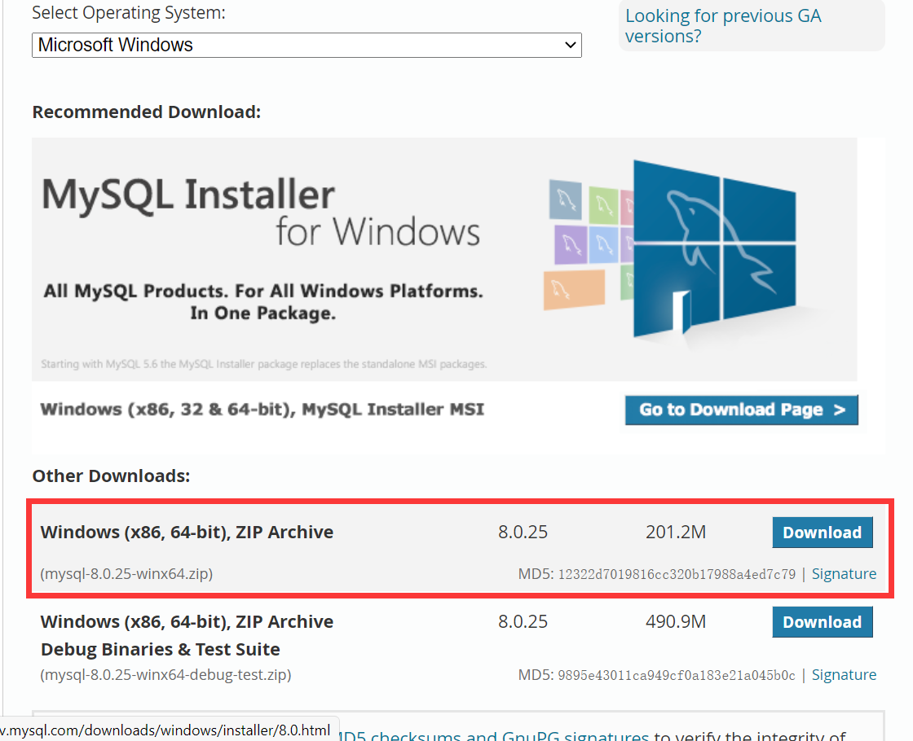

### mysql8.0.25安装

方法1、[mysql8.0.25安装配置教程(windows 64位)最详细！！！！_@WWWxp的博客-CSDN博客](https://blog.csdn.net/weixin_43579015/article/details/117228159)


方法2、

```
主要命令：
mysqld --initialize --console

mysqld --install mysql

net start mysql

mysql -uroot -p

ALTER USER 'root'@'localhost' IDENTIFIED BY '新的密码名'
```

详细：

###### 1.官网下载安装包，解压到指定路径



###### 2.配置初始化文件my.ini

在解压文件夹根目录下创建一个txt文件，名字叫my，文件后缀为ini
之后复制下面这个代码放在文件下（新解压的文件没有my.ini文件，需自行创建）
以下代码除安装目录和数据的存放目录需修改，其余不用修改，然后在根目录下创建一个data文件夹

```
[mysqld]
# 设置3306端口
port=3306
# 设置mysql的安装目录   ----------是你的文件路径-------------
basedir=C:\Program Files\Mysql-8.0.25-winx64
# 设置mysql数据库的数据的存放目录  ---------是你的文件路径data文件夹自行创建
datadir=C:\Program Files\Mysql-8.0.25-winx64\data
# 允许最大连接数
max_connections=200
# 允许连接失败的次数。
max_connect_errors=10
# 服务端使用的字符集默认为utf8mb4
character-set-server=utf8mb4
# 创建新表时将使用的默认存储引擎
default-storage-engine=INNODB
# 默认使用“mysql_native_password”插件认证
#mysql_native_password
default_authentication_plugin=mysql_native_password
[mysql]
# 设置mysql客户端默认字符集
default-character-set=utf8mb4
[client]
# 设置mysql客户端连接服务端时默认使用的端口
port=3306
default-character-set=utf8mb4
```

###### 3.初始化MySQL

使用管理员身份(不使用管理员身份当使用命令 mysqld --install mysql 会因权限不足被拒绝) 运行cmd，进入mysql的bin目录：	cd C:\Program Files\Mysql-8.0.25-winx64\bin

在MySQL目录下的bin目录下执行命令：	mysqld --initialize --console

记住root@localhost:之后的密码，下面登录要用( : 后有一个空格，不复制)

###### 4.安装mysql服务并启动+修改密码

（1）安装mysql服务命令：	mysqld --install mysql

提示：Service successfully installed 即成功安装


（2）启动mysql服务命令：	net start mysql

（3）连接mysql命令：	mysql -uroot -p

提示输入密码，输入刚刚保存下来的密码

输入以下命令修改密码

ALTER USER 'root'@'localhost' IDENTIFIED BY '新的密码';

密码修改完成

###### 5.部分疑难杂病

1、执行mysqld --install mysql如果提示该服务已存在

就先删除该服务（使用以下代码，需要管理员权限）：	sc delete mysql

然后在执行mysqld --install mysql

2、忘记初始密码或初始化失败

先清除根目录下data文件夹中的数据，然后在cmd中通过命令 sc delete mysql 删除原先数据

再输入 mysqld --initialize --console 重新初始化就能显示新的密码