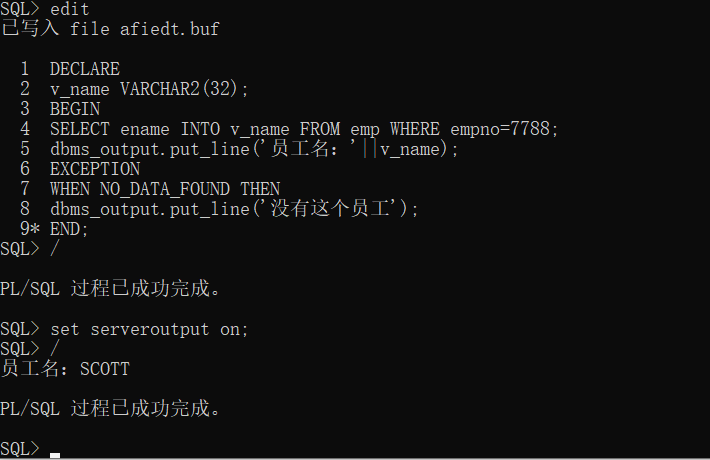

```sql
--格式如下，BEGIN,END是必要的
DECLARE
BEGIN
EXCEPTION
END
```

### 例.

```sql
DECLARE
v_name VARCHAR2(32);
--v_name emp.ename%TYPE;--定义一个类型与长度都和ename相同的变量
--v_emp emp%ROWTYPE;--定义一个和emp一样的表，调用字段为表明.字段名(v_emp.ename)
BEGIN
SELECT ename INTO v_name FROM emp WHERE empno=7788;
dbms_output.put_line('员工名：'||v_name);
EXCEPTION
WHEN NO_DATA_FOUND THEN
dbms_output.put_line('没有这个员工');
END;
/
```

### 结果

### 


### VARCHAR和VARCHAR2的区别         

![[avatar]](../图/PLSQL图2.png)

```sql
--简单循环
--WHILE循环
--FOR循环
DECLARE
CURSOR cur_emp IS SELECT * FROM emp;
v_emp  emp%ROWTYPE;
BEGIN
  OPEN cur_emp;--执行了游标所关联的SQL语句
  LOOP
    FETCH cur_emp INTO v_emp;
    EXIT WHEN cur_emp%NOTFOUND;--%NOTFOUND游标的属性
    dbms_output.put_line('员工名字：'||v_emp.ename||'，薪水：'||v_emp.sal);
  END LOOP;
  CLOSE cur_emp;
END;
/

DECLARE
CURSOR cur_emp IS SELECT * FROM emp;
v_emp  emp%ROWTYPE;
BEGIN
  OPEN cur_emp;--执行了游标所关联的SQL语句
  FETCH cur_emp INTO v_emp;--WHILE循环之前，必须先FETCH一次
  WHILE cur_emp%FOUND LOOP
    dbms_output.put_line('员工名字：'||v_emp.ename||'，薪水：'||v_emp.sal);
    FETCH cur_emp INTO v_emp;
  END LOOP;
  CLOSE cur_emp;
END;
/
```

### 游标

```
简单来说，游标就是一个临时存储器。SQL处理数据时，总是对整个数据集打包给你，而不会逐条给你，而游标就是将SQL打包的数据集进行二次处理，使得你能够逐条对数据修改和处理。(处理多行数据)
```

### 函数与存储过程

```sql
1.存储过程
存储过程（Stored Procedure）是在大型数据库系统中，一组为了完成特定功能的 SQL 语句集，经编译后存储在数据库中，用户通过指定存储过程的名字并给出参数（如果该存储过程带有参数）来执行它。存储过程是数据库中的一个重要对象，任何一个设计良好的数据库应用程序都应该用到存储过程。
创建存储过程语法
create [or replace] PROCEDURE 过程名[(参数名 in/out 数据类型)]
as/is
begin
PLSQL 子程序体；
End;

2.存储函数
存储过程和存储函数的区别
一般来讲，过程和函数的区别在于函数可以有一个返回值；而过程没有返回值。但过程和函数都可以通过 out 指定一个或多个输出参数。我们可以利用 out 参数，在过程和函数中实现返回多个值。
语法：
CREATE [OR REPALCE] FUNCTION function_name()
RETURN TYPE;
AS
BEGIN
END;

3.本质区别：
存储函数有返回值，而存储过程没有返回值。
3.1 如果存储过程想实现有返回值的业务，我们就必须使用out类型的参数。
3.2 即便是存储过程使用了out类型的参数，起本质也不是真的有了返回值，
3.3 而是在存储过程内部给out类型参数赋值，在执行完毕后，我们直接拿到输出类型参数的值。

```


### 自定义函数

```sql
--创建一个f1函数，输入一个字符串，判断是否是一个数字，若是返回1，否返回0
CREATE OR REPLACE FUNCTION f1(v_num VARCHAR2)
RETURN NUMBER 
AS
ex_char2number EXCEPTION;
PRAGMA EXCEPTION_INIT(ex_char2number,-6502);
BEGIN
  IF to_number(v_num)>=0 OR to_number(v_num)<=0 THEN
    RETURN 1;
  ELSE 
    RAISE ex_char2number;
  END IF;
EXCEPTION
  WHEN ex_char2number THEN
    RETURN 0;
END;
/
```

### 调用函数

```sql
1.
BEGIN
dbms_output.put_line(f1(KKKK));
END;

2.
SELECT showSal(KKKK) FROM dual;
```


